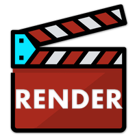

<h1 align="center">
   
  
  
   
  EZ Render
   
</h1>

<h4 align="center">Effortless renders for your <a href="https://www.toonboom.com/products/harmony" target="_blank">Toonboom Harmony</a> projects.</h4>

   

[English](readme.md) • [Español](readme-spa.md)

  <a href="#key-features">Key Features</a>
   •
  <a href="#how-to-install">How To Install</a>
   •
  <a href="#how-to-use">How To Use</a>
   <!-- • -->
  <!-- <a href="#how-to-use">Discord</a> -->

<!--  -->

## Key Features

EZ Render is a tool that automates the rendering process of your scene and has the following features:

- Make quick renders of your scenes from any toolbar.
- Create, twist & adapt your presets to the way you like to work.
- EZ Render will keep your presets so you won't have to configure them in between scenes
- Render multiple presets at once.
- Find your output folder quicker, when the render it's done, EZ Render will open the folder automatically so you can review your render quicker.
- Multiple display outputs, render multiple display nodes in batch.

## How to Install

- Download the [Latest Release](https://github.com/VisualDroids/EZ-Backup-for-Toonboom-Harmony/releases/latest) and extract it to a folder
- In Windows:
  - Run `Visual Droids EZ Render Windows Installer.exe`
  - If a `"Windows Protected your PC"` dialog shows up:
    - Click `More Info` then `Run Anyway`
- In macOS:
  - While holding `control` in your keyboard, single click `Visual Droids EZ Render MacOS Installer.app` and click `Open`
  - When a `"macOS cannot verify the developer..."` dialog shows up, click `Open`. If you can't find the `Open` button, try the last step again.
- Choose your Toonboom Harmony Version
- Click on `Install`

<!-- ## How to Use

- With Toonboom Harmony open, right-click any toolbar, choose `Visual Droids EZ Render` to add it

 -->
